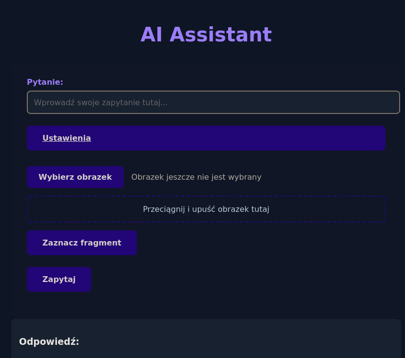

# wave4-spell-altar
Repository for the Spell Altar project realized during WAVE4 by the Spell Altar team supervised by Świta Znachora.

## Opis projektu

Spell Altar to inteligentny system wspomagający dział helpdesku w obsłudze zgłoszeń od klientów. Projekt został zrealizowany w ramach zespołu 4bin Code i prezentuje rozwiązanie wykorzystujące sztuczną inteligencję do automatycznego sugerowania odpowiedzi na problemy zgłaszane przez klientów

## Funkcjonalności

* **Automatyczna analiza zgłoszeń:** AI sprawdza zgłoszenia przed obsługą przez pracownika. W przypadku prostych problemów proponuje klientowi rozwiązanie.
* **Obsługa plików Excel:** System korzysta z bazy wiedzy w plikach Excel, zawierającej opisy błędów i ich rozwiązania.
* **OCR i obsługa obrazów:** Możliwość przesłania obrazka z opisem błędu – system rozpoznaje tekst z grafiki.
* **Korekta literówek:** Wykrywanie i korekta literówek w opisach błędów.
* **Panel wsparcia:** Pracownik supportu weryfikuje odpowiedzi AI i przekazuje trudniejsze zgłoszenia do programistów.
* **Aktualizacja bazy wiedzy:** Możliwość dodania nowych plików Excel oraz aktualizacji istniejącej bazy.

## Technologie

* **Backend:** Django
* **AI:** Sentence Transformer, sklearn (TF-IDF, cosine similarity)
* **OCR:** pytesseract, easyocr
* **Korekta literówek:** pyspellchecker
* **Zarządzanie projektem:** Poetry, GitHub Actions (CI/CD), Ruff, Mypy

## Instalacja

1. **Sklonuj repozytorium:**
```
git clone https://github.com/knsiczarnamagia/wave4-spell-altar.git
```
2. **Przejdź do katalogu projektu:**
```
cd wave4-spell-altar
```
3. **Zainstaluj zależności:**

```
make install
```

1. **Skonfiguruj zmienne środowiskowe i plik bazy wiedzy (Excel).**

2. **Uruchom aplikację zgodnie z dokumentacją projektu.**

---

## Przepływ zgłoszenia

1. **Klient zgłasza problem przez formularz (tekst/obrazek).**
2. **System analizuje zgłoszenie:**

* Rozpoznaje tekst z obrazka (OCR).
* Koreguje literówki.
* Wyszukuje rozwiązanie w bazie wiedzy.

---

## Interfejs graficzny

**System posiada prosty interfejs:**

formularz zgłoszeniowy,

możliwość przesyłania pliku Excel z bazą wiedzy,



## Przykładowe użycie

1. **Klient zgłasza błąd**
2. **System analizuje opis i/lub przesłany obrazek.**
3. **AI znajduje rozwiązanie w bazie lub prosi o dodatkowe informacje.**
4. **Pracownik supportu zatwierdza lub kieruje zgłoszenie dalej.**

---